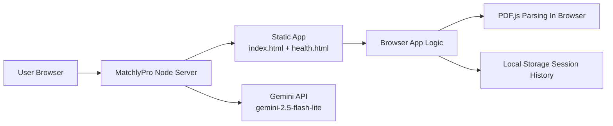
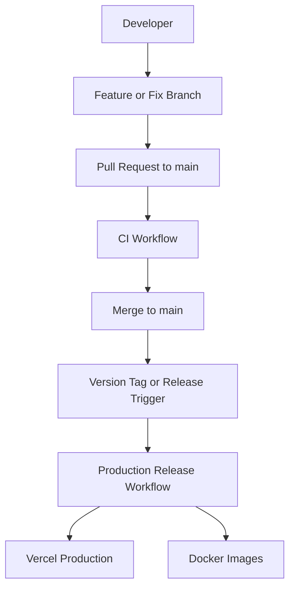
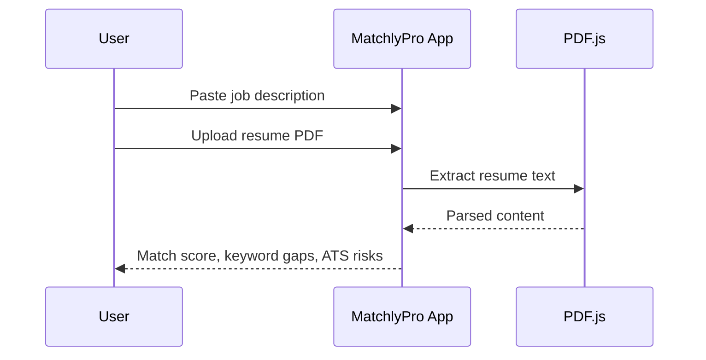
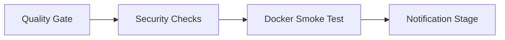
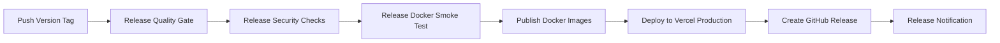

# MatchlyPro

MatchlyPro is a production-oriented resume matcher web app that compares a resume against a job description, highlights keyword coverage, surfaces ATS risks, and suggests practical improvements. It now supports server-side AI analysis through the Gemini API.

This repository is designed as a portfolio project that shows both product engineering and delivery discipline:

- product design and implementation
- client-side PDF parsing with PDF.js
- production-ready hosting with a lightweight Node server
- containerized runtime with Node and Docker
- CI checks with GitHub Actions
- release-gated production promotion
- basic security scanning and smoke validation

## Live Project

- Production app: [https://matchlypro.vercel.app](https://matchlypro.vercel.app)
- Repository: [https://github.com/muhammadhammad2005/MatchlyPro](https://github.com/muhammadhammad2005/MatchlyPro)

## Portfolio Positioning

This is a strong portfolio example for:

- frontend product engineering
- shipping polished browser-based tools
- practical CI/CD ownership
- containerization and deployment workflows
- release-based production control for the app runtime

It is not a full multi-tenant SaaS yet because there is no database, authentication, billing, or persistent user accounts. It is better described as a production-minded web product with AI-assisted analysis and practical DevOps discipline than as a complete SaaS platform.

## What The App Does

- compares a resume with a job description in real time
- extracts text from uploaded PDF resumes in the browser
- calculates an overall match score
- groups results into strong, partial, and missing keywords
- flags ATS issues and resume risks
- offers copy, export, and local save actions
- works on desktop and mobile

## Core Stack

- HTML5
- CSS3
- Vanilla JavaScript
- PDF.js
- Node.js
- Docker
- GitHub Actions
- GitHub Releases
- Vercel
- Snyk
- gitleaks

## Production Architecture



## Delivery Architecture



## How The App Works



## Key Engineering Highlights

### Product experience

- browser-first workflow with no account required
- privacy-friendly resume analysis
- responsive single-page interface
- local history and export utilities

### Delivery discipline

- CI runs on branches, pull requests, and main
- Docker smoke validation is part of CI
- production deployment is separated from ordinary CI runs
- Vercel Git auto-deploy is disabled for tighter release control

### Security posture

- gitleaks scan for secret detection
- `npm audit` at high severity threshold
- Snyk dependency scanning
- health endpoint verification in container checks

## CI Pipeline

File: [.github/workflows/ci-cd.yml](</e:/Apps/Resume Matcher/.github/workflows/ci-cd.yml>)

Pipeline stages:

`Quality Gate -> Security Checks -> Docker Smoke Test -> Notification Stage`

CI runs on:

- pushes to `main`
- pushes to delivery branches such as `feature/**`, `fix/**`, `chore/**`
- pull requests targeting `main`
- manual workflow dispatch

CI does not deploy production.

### CI flow



## Release And Production Deployment

File: [.github/workflows/release.yml](</e:/Apps/Resume Matcher/.github/workflows/release.yml>)

Production release stages:

`Release Quality Gate -> Release Security Checks -> Release Docker Smoke Test -> Publish Release Images -> Deploy Release to Vercel Production -> Publish GitHub Release -> Release Notification Stage`

This release workflow is separated from routine CI so production is not updated by every merge.

### Release flow



## Open Source Release Safety

This repository is public, but that does not mean random users can deploy production.

Production deployment remains under maintainer control because:

- only users with write access can push tags to the upstream repository
- GitHub Actions secrets are only available in the main repository context
- forks do not get access to production secrets like `VERCEL_TOKEN`
- Vercel Git auto-deploy is disabled in [vercel.json](</e:/Apps/Resume Matcher/vercel.json>)

In practical terms, someone can fork the repo and run their own copy, but they cannot deploy this repository's production environment without maintainer permissions and secrets.

## Deployment Rules

- normal pushes and pull requests run CI only
- production deployment is promoted through the release workflow
- Vercel production is deployed via CLI with repository secrets
- Docker images are published as release artifacts

## Local Development

### Run with Node

1. Create a local env file from the example:

```bash
cp .env.example .env
```

2. Set these values:

- `GEMINI_API_KEY`
- `GEMINI_BASE_URL=https://generativelanguage.googleapis.com/v1beta/openai/`
- `GEMINI_MODEL=gemini-2.5-flash-lite`

3. Start the app:

```bash
npm ci
npm start
```

Open `http://localhost:3000`

If the Gemini env vars are not set, the app still runs and falls back to local heuristic analysis.

### Run with Docker

```bash
docker build --target production -t resume-matcher .
docker run --rm -p 8080:8080 resume-matcher
```

Open `http://localhost:8080`

## Local Validation

```bash
npm run ci:validate
```

This validates project structure and runs static smoke checks.

## Release Usage

Current production promotion is tag-driven.

```bash
git checkout main
git pull origin main
git tag v1.0.0
git push origin v1.0.0
```

That release tag triggers the production workflow, publishes release artifacts, and deploys the tagged version to Vercel production.

## Operations Notes

- `vercel.json` disables Git-based Vercel auto deployment
- the app exposes `/health` for deployment verification
- Docker runtime uses the Node server for app and API delivery
- CI and release jobs depend on repository secrets for external integrations

## Repository Structure

```text
.
|-- .github/
|   |-- CODEOWNERS
|   |-- pull_request_template.md
|   `-- workflows/
|       |-- ci-cd.yml
|       `-- release.yml
|-- scripts/
|   |-- smoke-static-site.mjs
|   `-- validate-project.mjs
|-- CONTRIBUTING.md
|-- Dockerfile
|-- LICENSE
|-- README.md
|-- .env.example
|-- health.html
|-- index.html
|-- nginx.conf
|-- package.json
|-- server.mjs
`-- vercel.json
```

## Production Readiness Summary

This repository is portfolio-ready for a production-minded web app because it includes:

- a deployed live product
- a clear branching and promotion story
- CI separate from production deployment
- containerization and runtime health checks
- release automation
- security scanning
- reviewer-facing documentation

## Current Limitations

- no persistent backend storage
- no persistent database
- no authentication or user accounts
- no billing or subscriptions
- no staging environment yet
- no end-to-end browser test suite yet

## Recommended Next Upgrades

- add a staging deployment environment
- add Playwright end-to-end tests
- add Lighthouse and accessibility checks in CI
- add a custom domain
- add analytics and error monitoring
- add persistent storage for saved sessions or team features

## Author

Muhammad Hammad

Built, containerized, documented, deployed, and automated as a portfolio project to demonstrate product engineering with practical DevOps ownership.
